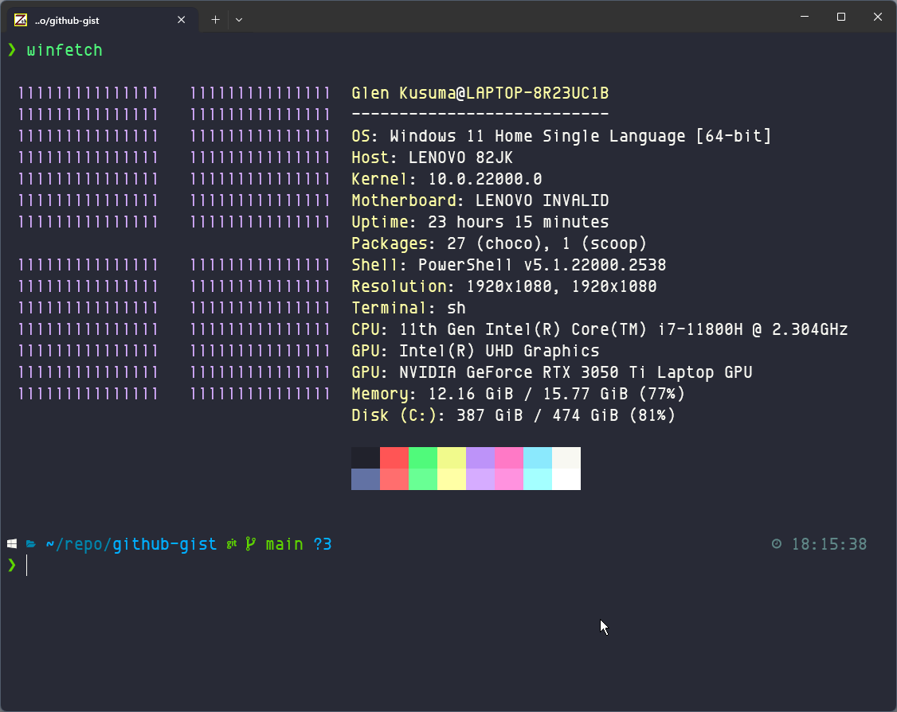

# Install Git Bash with ZSH, OH MY ZSH & POWERLEVEL10K | Windows Guide



## 1. Download & Install Git Bash

<https://git-scm.com/download/win>

## 2. Download & Install ZSH

### 1. Download & Install Nerd Font

<https://www.nerdfonts.com/font-downloads>. You can choose & install your own fonts style by viewing <https://www.programmingfonts.org>. In this guide I'm using `EnvyCodeR Nerd Font Mono` <https://github.com/ryanoasis/nerd-fonts/releases/download/v3.1.0/EnvyCodeR.zip>.

### 2. Download the latest zsh package

<https://packages.msys2.org/package/zsh?repo=msys&variant=x86_64>

Example:

```txt
zsh-5.9-2-x86_64.pkg.tar.zst
```

The package is compacted using `zst`, so we need some "special" extractor.  
In my case, I've downloaded this file   <https://mirror.msys2.org/msys/x86_64/zsh-5.9-2-x86_64.pkg.tar.zst>
And extracted it using the Peazip.  <https://peazip.github.io/zst-compressed-file-format.html>.

### 3. Extract the content to your git bash installation dir

By default in ```"C:\Program Files\Git"```

### 4. Test it and configure zsh

Open git bash and type:

```bash
zsh
```

This is a important step, `zsh` will ask a few configurations, like the tab completion, history, etc.  Please read the options and set the config to your use.

### 5. Edit the `~/.minttyrc` file. (create it if it doesn't exist)

```.minttyrc
BoldAsFont=no
Font=EnvyCodeR Nerd Font Mono
FontHeight=14
Columns=180
Rows=46
ScrollbackLines=2000
BackgroundColour=13,13,13
MiddleClickAction=void
RightClickAction=paste
Language=
BellType=0
BellFlash=yes
Printer=Microsoft Print to PDF
Transparency=off
CursorBlinks=yes
ThemeFile=nord
ForegroundColour=178,178,178
CursorColour=225,225,225
FontSmoothing=full
Locale=en_US
Charset=UTF-8
Term=xterm-256color
BoldAsColour=no
CursorType=block
```

### 6. Configure git-prompt.sh

If you get this message:

`ERROR: this script is obsolete, please see git-completion.zsh`

It is because etc\profile.d\git-prompt.sh does not check the shell before including git-completion.bash. To fix it you can create an empty file:

```bash
mkdir ~/.config/git

echo "" > ~/.config/git/git-prompt.sh
```

## 3 Configuring zsh

### a. zsh as standalone shell

edit `/etc/zsh/zshenv` and add this line at the begining of the file:

```bash
PATH=/mingw64/bin/usr/bin:/usr/bin:/bin:$PATH
```

### b. Configuring zsh as default shell when launching Git Bash

#### Edit the `C:\Program FIles\Git\etc\bash.bashrc> file

Add the following lines at the end of the file

```bash
# Get user bash configuration ~/.bashrc
source ~/.bashrc;
```

#### Edit the `~/.bashrc` file. (create it if it doesn't exist)

Add the following lines at the end of the file

```bash
# Launch Zsh
if [ -t 1 ]; then
exec zsh
fi
```

#### Close and open again the git bash

## 4. Install Zsh plugins

### install zsh-autosuggestions plugin

1. Install & Run

    ```bash
    git clone https://github.com/zsh-users/zsh-autosuggestions $ZSH/plugins/zsh-autosuggestions

    source $ZSH/plugins/zsh-autosuggestions/zsh-autosuggestions.zsh
    ```

2. edit `~/.zshrc` file

    ```zshrc
    plugins=( 
      ...
      zsh-autosuggestions
    )
    ```

### install zsh-syntax-highlighting plugin

1. Install & Run

    ```bash
     git clone https://github.com/zsh-users/zsh-syntax-highlighting.git $ZSH/plugins/zsh-syntax-highlighting

    source $ZSH/plugins/zsh-syntax-highlighting/zsh-syntax-highlighting.zsh
    ```

2. edit `~/.zshrc` file

    ```zshrc
    plugins=( 
        ...
        zsh-syntax-highlighting
    )
    ```

## 5. Install oh-my-zsh

### execute the following cmd on git bash  

```bash
sh -c "$(curl -fsSL https://raw.githubusercontent.com/ohmyzsh/ohmyzsh/master/tools/install.sh)"
```

## 6. Install Powerlevel10k

### 1. Install Powerlevel10k

```bash
git clone --depth=1 https://github.com/romkatv/powerlevel10k.git ${ZSH_CUSTOM:-$HOME/.oh-my-zsh/custom}/themes/powerlevel10k
```

### 2. Restart Zsh

```bash
exec zsh
```

### 3. Configuration Wizard

if the configuration wizard doesn't start automatically, type:

```bash
p10k configure
```

So, this step is important, the `p10k` will ask a few configurations for the theme.  
Please read the options and set that according to your use.

# Optional

## Add zsh as Vscode default terminal

### 1. Add this section to the VS Code `settings.json` file

#### a. For Git Bash with Zsh as default shell

```json
"terminal.integrated.profiles.windows": {
  "Git Zsh": {
    "path": "C:\\Program Files\\Git\\bin\\bash.exe",
    "args": []
  }
}
```

#### b. For zsh standalone shell

```json
"terminal.integrated.profiles.windows": {
  "Git Zsh": {
    "path": "C:\\Program Files\\Git\\usr\\bin\\zsh.exe",
    "args": []
  }
}
```

### 2. Change the default shell in the same file

```json
"terminal.integrated.defaultProfile.windows": "Git Zsh",
```

### 3. Change the font to nerd font

```json
"terminal.integrated.fontFamily": "'EnvyCodeR Nerd Font Mono'",
```

## Add Zsh shell as Windows Terminal default

```json
    "defaultProfile": "{2ece5bfe-50ed-5f3a-ab87-5cd4baafed2b}",
    "profiles": 
    {
        "defaults": 
        {
            "colorScheme": "Dracula",
            "font": 
            {
                "face": "EnvyCodeR Nerd Font Mono",
                "size": 13.0
            }
        },
        "list": 
        [   
            {
                "guid": "{2ece5bfe-50ed-5f3a-ab87-5cd4baafed2b}",
                "hidden": false,
                "name": "Git Bash",
                "source": "Git"
            },
            {
                "commandline": "\"C:\\Program Files\\Git\\usr\\bin\\zsh.exe\"",
                "guid": "{e6e5aa33-9fe2-4a7c-b60f-249f09413300}",
                "hidden": false,
                "icon": "C:\\Program Files\\Git\\usr\\bin\\zsh.exe",
                "name": "Git Zsh",
                "startingDirectory": "%USERPROFILE%"
            }
        ]
    },
    "schemes": 
    [
        {
            "background": "#282A36",
            "black": "#21222C",
            "blue": "#BD93F9",
            "brightBlack": "#6272A4",
            "brightBlue": "#D6ACFF",
            "brightCyan": "#A4FFFF",
            "brightGreen": "#69FF94",
            "brightPurple": "#FF92DF",
            "brightRed": "#FF6E6E",
            "brightWhite": "#FFFFFF",
            "brightYellow": "#FFFFA5",
            "cursorColor": "#F8F8F2",
            "cyan": "#8BE9FD",
            "foreground": "#F8F8F2",
            "green": "#50FA7B",
            "name": "Dracula",
            "purple": "#FF79C6",
            "red": "#FF5555",
            "selectionBackground": "#44475A",
            "white": "#F8F8F2",
            "yellow": "#F1FA8C"
        },
    ],

```
